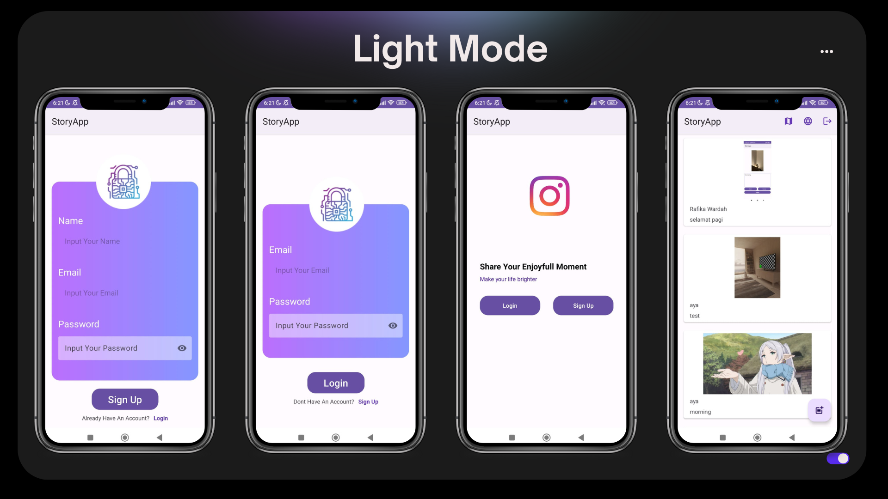
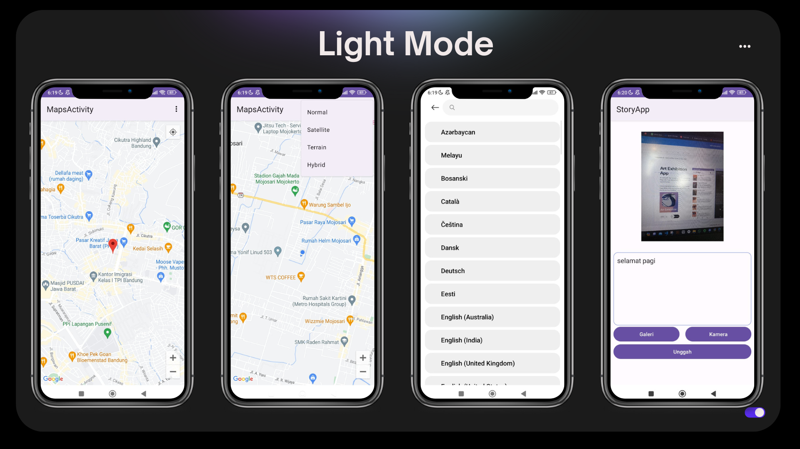

# StoryApp
 Project ini merupakan applikasi untuk membuat story dan juga dapat share location saat ini maupun menandai lokasi. Project ini menggunakan bahasa kotlin dan xml

## Preview 

     
     

## Features 
- Applications can add users to the favorites list.
- Preserves the features from previous versions.
- Correctly displays a list of stories on a map.
- Accurately uses Paging 3 to display a list of stories.
- Maintains clean code standards.
- Supports localization.
- Interacts with APIs effectively.
- Correctly implements Android Architecture Components, such as ViewModel and LiveData.

 
